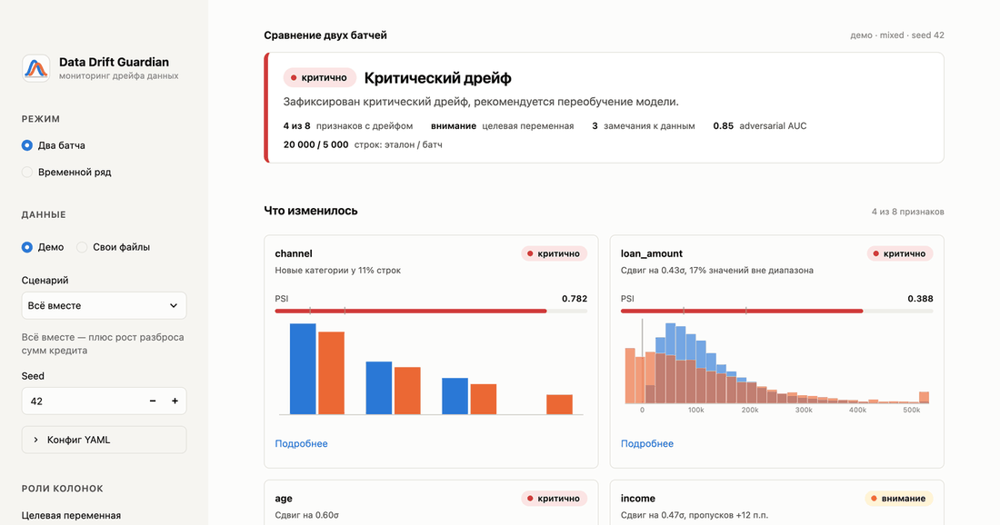

# Data Drift Guardian

[](https://github.com/dmagog/mts-shad-drift-guardian/actions/workflows/tests.yml)

Система детекции дрейфа данных и контроля их качества для ML-моделей в продакшене.
Сравнивает эталонную выборку (на которой обучалась модель) с текущим продакшн-батчем
или с потоком батчей во времени и выдаёт структурированный отчёт с метриками и алертами —
без нейросетей, на математической статистике и классическом ML. Результат доступен
как словарь Python, интерактивный дашборд на Streamlit, самодостаточный HTML-отчёт, JSON
и код возврата CLI.

Итоговый проект «4.0 Школы аналитиков данных» МТС, задача № 4. Заказчик — Бояджи Владислав.

## Как это выглядит


Вердикт с рекомендацией и ключевыми фактами, ниже — карточки поплывших признаков с объяснением,
полосой PSI и мини-графиком «эталон против батча». Обзор остальных экранов: панель признака,
разрез по сегментам, временной ряд и HTML-отчёт.



Кадры по отдельности лежат в [docs/images](docs/images). Статичные снимки делает
`scripts/make_screenshots.py`, запись с курсором и кликами — `scripts/make_walkthrough.py`
(headless Chrome через Selenium, сборка GIF через ffmpeg).

## Что умеет

Английские названия модулей — это блоки архитектуры из технического задания.

| Модуль | Что делает |
|---|---|
| **Data Ingestion Core** (`io.py`, `schema.py`, `columns.py`) | Загрузка CSV/Parquet; сверка набора колонок и семейств типов; автоматическое определение ролей: идентификаторы и даты пропускаются с объяснением, а не анализируются как признаки. |
| **Data Quality** (`data_quality.py`) | Рост доли пропусков, дубликаты строк, значения вне допустимого диапазона, недопустимые категории, константные колонки. Границы и категории — из контракта данных или из эталона. |
| **Drift Engines** (`drift_engines.py`) | Числовые: KS-тест, PSI, дистанция Йенсена–Шеннона, расстояние Вассерштейна. Категориальные: хи-квадрат, PSI, Йенсен–Шеннон. Пороги откалиброваны между собой, бутстреп-защита от малых выборок. |
| **Adversarial Validation** (`adversarial.py`) | LightGBM учится отличать эталон от батча; ROC-AUC ≫ 0.5 — многомерный сдвиг подтверждён, feature importance показывает, что изменилось сильнее всего. |
| **Концептуальный дрейф** (`guardian.py`) | Целевая переменная и предсказания модели анализируются отдельными блоками: если признаки стабильны, а цель изменилась — отдельная рекомендация. |
| **Мониторинг во времени** (`timeline.py`) | Поток батчей по дням/неделям/месяцам: относительно фиксированного эталона (накопленный дрейф) и относительно предыдущего периода (скачки); момент начала дрейфа. |
| **Разрез по сегментам** (`guardian.py`) | Анализ повторяется внутри каждого значения категориальной колонки (регион, канал): тепловая карта PSI «сегмент × признак», локальный дрейф поднимает общий статус. |
| **Оркестратор** (`guardian.py`) | Единый отчёт: сводная серьёзность, алерты на русском, рекомендация «наблюдать / переобучать». |
| **Визуализация и экспорт** (`plots.py`, `html_report.py`, `app/`, `cli.py`) | Графики «эталон против батча» и по периодам (Plotly), дашборд Streamlit с подсветкой «поплывших» признаков, HTML-отчёты, JSON, YAML-конфиг, командная строка с кодом возврата. |

## Быстрый старт

```bash
python -m venv .venv && source .venv/bin/activate
pip install -e ".[dev]"
```

```python
from drift_guardian import DriftConfig, analyze
from drift_guardian.demo import make_demo

reference, current = make_demo("mixed")             # демо-данные кредитного скоринга с дрейфом
report = analyze(reference, current, DriftConfig(target_column="target"))

print(report["overall_severity"])                   # "critical"
print(report["recommendation"])
for alert in report["alerts"]:
    print(alert)
```

Поток во времени:

```python
from drift_guardian import run_timeline_from_frame
from drift_guardian.demo import make_timeline_demo

reference, stream = make_timeline_demo(n_periods=8)             # поток с колонкой date
timeline = run_timeline_from_frame(
    reference, stream, "date", "M", DriftConfig(target_column="target"), compare_previous=True
)
for period in timeline["periods"]:
    previous = period["vs_previous"]  # None у первого периода
    print(period["label"], period["overall_severity"], "к предыдущему:", previous and previous["overall_severity"])
```

Разрез по сегментам:

```python
report = analyze(reference, current, DriftConfig(target_column="target", segment_column="region"))
for segment in report["segments"]:
    print(segment["label"], segment["overall_severity"], segment["psi_by_column"])
```

Из командной строки (код возврата 0 — ok, 1 — warning, 2 — critical; для потока — худший период).
Демо-CSV в репозитории не хранятся: сначала сгенерируйте их (seed фиксирован):

```bash
python scripts/generate_demo.py --out data/demo --seed 42
drift-guardian --reference data/demo/reference.csv --current data/demo/current_mixed.csv \
    --target target --exclude customer_id --html report.html --json report.json
```

```bash
drift-guardian --reference reference.csv --current stream.csv --date-column date --freq M \
    --compare-previous --target target --html timeline.html
```

```bash
drift-guardian --reference reference.csv --current batch.csv --segment region --html report.html
```

Скрипт `scripts/generate_demo.py` создаёт эталон и шесть сценариев дрейфа (`current_*.csv`);
те же данные доступны без файлов через `drift_guardian.demo.make_demo`.

## Дашборд

```bash
streamlit run app/streamlit_app.py
```

Откроется `http://localhost:8501`. Страница отвечает на вопросы в порядке важности.

1. **Есть ли проблема** — вердикт наверху: статус, рекомендация, ключевые факты.
2. **Что изменилось** — ранжированные карточки признаков с объяснением («сдвиг на 0.6σ»,
   «новые категории у 11% строк»), полосой PSI с порогами и мини-графиком «эталон против батча».
3. **Подробности** — блок целевой переменной, замечания к данным и вкладки: все признаки,
   распределения, схема и качество, adversarial validation, экспорт HTML / JSON / YAML.

Два режима. **«Два батча»** сравнивает эталон с одним батчем. **«Временной ряд»** показывает
статусы и PSI по периодам относительно эталона и относительно предыдущего периода и разбирает
любой период против любого из них.

В боковой панели — источник данных (демо или свои CSV/Parquet), роли колонок (целевая переменная,
предсказания модели, исключения, сегмент) и разрез по сегментам: таблица и тепловая карта PSI
«сегмент × признак». Пороги и параметры убраны в раскрывающийся блок.

Круг замыкается. Готовый YAML-конфиг (пороги, `column_thresholds`, контракт данных, роли колонок)
загружается файлом: ползунки отключаются, роли колонок берутся из файла. Настроенный в интерфейсе
конфиг скачивается во вкладке «Экспорт» и годится и для повторной загрузки, и для CLI (`--config`).

На широких таблицах интерфейс не разъезжается: карточки показываются по шесть с кнопкой
«Показать ещё», у таблицы признаков есть поиск по имени и фильтр «только с дрейфом», длинные
имена на тепловой карте усекаются (полное имя — в подсказке).

Статусы передаются цветом и словом: «в норме» (`ok`), «внимание» (`warning`),
«критично» (`critical`). Deep-link: `?mode=stream`, `?scenario=concept_drift`, `?segment=region`.

## Docker

```bash
docker build -t drift-guardian .
docker run --rm -p 8501:8501 drift-guardian
```

## Контракт данных (конфигурация)

Все параметры — в `DriftConfig`; их можно хранить в YAML рядом с моделью
(пример — [`examples/config.yaml`](examples/config.yaml)):

```yaml
target_column: target                 # целевая переменная → блок концептуального дрейфа
prediction_column: null               # предсказания модели → блок дрейфа предсказаний
exclude_columns: [customer_id, dt]    # идентификаторы и даты не анализируются
segment_column: region                # разрез по сегментам (до max_segments самых частых значений)
value_bounds: {age: [18, 90]}         # допустимые диапазоны по бизнес-правилам
allowed_categories: {employment_type: [наёмный, ИП, самозанятый, безработный]}
thresholds: {psi_warning: 0.1, psi_critical: 0.2}
column_thresholds:                    # поколоночные переопределения порогов
  income: {psi_warning: 0.2, psi_critical: 0.4}
```

```python
config = DriftConfig.from_yaml("examples/config.yaml")
```

Если границы и категории не заданы, они выводятся из эталона: `[min, max]` и множество
наблюдавшихся категорий. Идентификаторы (почти все значения уникальны) и колонки с датами
распознаются автоматически и пропускаются с пояснением в отчёте; эвристику можно
переопределить списками `numeric_columns` / `categorical_columns`.

## Контракт результата

Вход: два `pandas.DataFrame` — `reference` (эталон) и `current` (текущий батч).
Выход: словарь (пример — [`examples/drift_report_mixed.json`](examples/drift_report_mixed.json)).

```text
overall_severity   "ok" | "warning" | "critical"
recommendation     текстовая рекомендация (наблюдать / переобучать / концептуальный дрейф)
alerts             список человекочитаемых алертов
schema             замечания к схеме (пропавшие колонки, новые колонки, смена типов)
data_quality       замечания к качеству (пропуски, дубликаты, диапазоны, категории, малые батчи)
columns            по каждому признаку: kind, severity и список тестов
                   {name, statistic, p_value, severity, threshold, details}
target_drift       блок целевой переменной (та же структура, что у признака) или null
prediction_drift   блок предсказаний модели или null
adversarial        {roc_auc, severity, backend, n_rows_used, top_features}
meta               размеры выборок, списки колонок, alpha с поправкой, снимок конфига
```

Поле `segments` (если задана `segment_column`) — список сводок по сегментам: строки и доли,
статус, число критичных признаков, PSI по колонкам, алерты. Для потока `run_timeline` возвращает
`{"periods": [...], "columns": [...], "reference_rows", "meta"}`, где каждый период — статус,
рекомендация, число критичных признаков, PSI по колонкам, алерты и, при `compare_previous=True`,
такая же сводка `vs_previous` относительно предыдущего периода.

Объектный API: `DriftGuardian(config).run(reference, current)` возвращает `DriftReport`
(dataclass), `.to_dict()` — тот же словарь.

## Пороги и логика алертов

| Метрика | warning | critical |
|---|---|---|
| PSI | ≥ 0.10 | ≥ 0.20 |
| Дистанция Йенсена–Шеннона | ≥ 0.10 | ≥ 0.20 |
| Вассерштейн / std эталона | ≥ 0.30 | ≥ 0.50 |
| KS, хи-квадрат | p < α/k (Бонферрони) **и** размер эффекта ≥ warning | — |
| Adversarial ROC-AUC | ≥ 0.55 | ≥ 0.65 |
| Прирост доли пропусков | ≥ 5 п. п. | ≥ 15 п. п. |
| Доля значений вне диапазона | ≥ 1% | ≥ 5% |
| Доля строк с недопустимыми категориями | ≥ 1% | ≥ 5% |

Пороги настраиваются через `DriftConfig` / `Thresholds` и ползунками в дашборде; для отдельных
признаков их переопределяет `column_thresholds` (шумные признаки, известная сезонность).

### Калибровка порогов

Пороги трёх метрик размера эффекта согласованы между собой, чтобы ни одна из них
не «перетягивала» вердикт. Значения при известных сдвигах нормального признака
(10 квантильных бинов, 200 000 наблюдений; полные таблицы — `report/experiments.md`):

| Сдвиг среднего | PSI | JS | W/σ | Вердикт |
|---|---|---|---|---|
| 0.2σ | 0.040 | 0.084 | 0.204 | ok |
| 0.3σ | 0.086 | 0.124 | 0.299 | warning (JS) |
| 0.4σ | 0.153 | 0.165 | 0.400 | warning |
| 0.5σ | 0.239 | 0.205 | 0.499 | critical |

Доли категорий ограничены снизу значением 10⁻⁴: без сглаживания PSI «взрывался» на любой
новой категории (1% новой категории давал PSI > 0.2), теперь 1% → 0.05, 5% → 0.31.

Пороги откалиброваны на нормальном признаке. Для скошенных и ограниченных распределений
(логнормальное, экспоненциальное, равномерное) PSI и JS срабатывают раньше — сдвиг на 0.3σ
сильно меняет их форму, — а Вассерштейн/σ по построению не зависит от формы. Совместное
использование трёх метрик даёт и «форму», и «положение» (таблицы — `report/experiments.md`).

### Двухключевое правило для p-value-тестов

KS и хи-квадрат фиксируют факт статистически значимого сдвига. Но на больших выборках
значимым становится любой микросдвиг, а на одинаковых распределениях они ложно срабатывают
с частотой α.

Поэтому такой тест считается сработавшим, только если одновременно хотя бы одна метрика
размера эффекта превысила порог warning. Уровень `critical` определяют только метрики
размера эффекта; значение p-value и флаг `significant` всегда есть в отчёте.

На 30 батчах без дрейфа наивное правило «p < α» дало ложные алерты в 2 батчах,
двухключевое — ни в одном.

### Защита от малых выборок

PSI и JS смещены вверх на малых батчах: их ожидание при отсутствии дрейфа примерно
(k − 1)·(1/n_эталон + 1/n_батч).

Для каждой колонки параметрический бутстреп по биновым счётчикам оценивает шумовой уровень
(99-й процентиль метрики, если бы батч был выборкой из эталона) и доверительный интервал
оценки. Если шумовой уровень выше порога warning, порог поднимается до него, а колонка
помечается `underpowered`. Так на батче в 150 строк система не поднимает тревогу из-за шума,
но сильный сдвиг всё равно ловит.

На 30 батчах в 100 строк без дрейфа число колонок с ложными срабатываниями PSI и JS падает
со 117 из 270 до 7, а от 500 строк их нет совсем (`report/experiments.md`). Защита отключается
параметром `sample_size_guard`.

### Поведение на «неудобных» данных

Систему проверили на граничных сценариях (`tests/`, раздел «Эксперименты» отчёта) и ведёт себя
предсказуемо:

- **Строки-двойники.** Точные совпадения строк между эталоном и батчем (перекрывающиеся окна,
  общие клиенты) исключаются из adversarial validation: иначе кросс-валидация «узнавала» бы
  двойников и на идентичных выборках давала ROC-AUC около 0.77. Доля совпадений — в поле
  `adversarial.overlap_share`; полностью идентичные выборки получают вердикт «в норме».
- **Слишком маленький батч или эталон.** Меньше `min_samples` строк (по умолчанию 20) с любой
  стороны — вердикт «внимание» с рекомендацией накопить данные, `meta.insufficient_data = true`;
  статистические тесты и проверки качества пропускаются, а не рапортуют «ок» или мусорные
  алерты (в потоке это касается и сравнения с крошечным предыдущим периодом). Батч от 20 до нескольких сотен строк анализируется
  с защитой от малых выборок, и рекомендация упоминает сниженную чувствительность.
- **Проверки качества данных** тоже работают по двухключевому правилу: доля пропусков, дубликатов,
  значений вне диапазона или новых категорий должна превысить порог **и** статистически отличаться
  от нуля. Одна пустая ячейка в батче из 10 строк не превращается в «+10 п. п. пропусков».
- **Бесконечности** в числовых колонках считаются ошибкой данных (отдельное замечание) и не
  ломают метрики. **Категории, отличающиеся только пробелами или регистром**, помечаются
  как новые, но с подсказкой «скорее всего, изменился пайплайн подготовки данных».
- **Дубликаты имён колонок** останавливают анализ с критическим замечанием; идентификаторы,
  свободный текст и даты пропускаются с пояснением; имена колонок могут быть не строками.
- **CSV в UTF-8, UTF-8 с BOM или cp1251** читаются автоматически. Строки потока с нераспознанной
  датой не теряются молча: их число попадает в `meta.dropped_rows` и на экран.
- **Большие данные.** Adversarial validation сама выбирает число потоков LightGBM: один на малых
  выборках (многопоточность там только мешает), четыре — от миллиона ячеек; на широких матрицах
  используется подвыборка колонок.
- **Константный эталон.** Если признак в эталоне почти не менялся (std ≈ 0), PSI и JS вырождаются,
  а «сдвиг в σ эталона» превращался в астрономическое число. Теперь сдвиг нормируется на разброс
  объединённой выборки («константа изменилась» — сдвиг около 2σ), карточка показывает долю значений вне диапазона вместо бесполезного PSI 0.000 и пишет «эталон почти константен».
- **Непересекающиеся диапазоны.** Если значения признака в батче целиком лежат вне диапазона
  эталона, система добавляет подсказку: такой признак чаще всего оказывается временем, счётчиком
  или идентификатором, который стоит исключить (реальный пример — колонка `date` в датасете
  electricity). Само обнаружение при этом не глушится.

### Концептуальный дрейф

Если указана `target_column`, целевая переменная не участвует в анализе признаков
и adversarial validation, а проверяется отдельно. Когда признаки стабильны, а цель
изменилась, система выдаёт отдельную рекомендацию: вероятен концептуальный дрейф,
нужны свежие размеченные данные. Демо-сценарий `concept_drift` показывает именно это.

## Реальные данные

Помимо синтетики систему прогнали на трёх открытых датасетах OpenML разной формы:
[adult](https://www.openml.org/d/1590), [credit-g](https://www.openml.org/d/31) и
[electricity](https://www.openml.org/d/151). Датасеты скачивает `scripts/real_data_gallery.py`,
отчёты — в [`examples/real/gallery.md`](examples/real/gallery.md).

- **adult** (14 признаков, 49 тыс. строк): случайный сплит — «в норме», adversarial AUC 0.50;
  батч из людей старше 50 лет — «критично» по возрасту, семейному положению и образованию
  при стабильной доле целевой переменной.
- **credit-g** (20 признаков, 700 против 300 строк) — «в норме».
- **electricity**: начало против конца временного ряда — «критично» по ценам и спросу
  с разрезом по дням недели.

Именно этот прогон выявил и помог исправить два дефекта: поведение на константном эталоне
и на колонках-времени (см. выше).

## Сверка с Evidently

Метрики сверили с библиотекой Evidently её собственными функциями статтестов: на демо-сценариях
и на датасете bank-marketing. Скрипт `scripts/benchmark_evidently.py` работает в отдельном
окружении `.venv-bench`, результаты — в `report/benchmark_evidently.md`.

Расстояние Вассерштейна и p-value KS совпадают точно. PSI и JS согласованы по ранжированию
(Spearman ρ 0.97 и 0.96), расхождения — из-за разного разбиения на бины и сглаживания.
Решения «дрейф / нет» совпали с методом Evidently по умолчанию в 45 из 47 колонок.

## Структура репозитория

```text
drift_guardian/                 пакет
  config.py                     пороги, параметры, контракт данных, YAML
  contracts.py                  dataclass-контракт результатов
  columns.py                    типы и роли колонок, автодетекция идентификаторов и дат
  io.py                         загрузка CSV / Parquet
  schema.py                     Schema Validation
  data_quality.py               Data Quality
  drift_engines.py              статистические тесты дрейфа, бутстреп шумового уровня
  adversarial.py                Adversarial Validation (LightGBM)
  guardian.py                   оркестратор, точка входа analyze()
  timeline.py                   мониторинг во времени
  demo.py                       генератор демо-данных (6 сценариев, таргет, поток)
  plots.py                      графики Plotly и таблицы
  html_report.py                HTML-отчёты и экспорт JSON
  cli.py                        командная строка (drift-guardian)
app/streamlit_app.py            дашборд Streamlit
scripts/generate_demo.py        демо-данные в CSV
scripts/make_screenshots.py     скриншоты для README (нужны Selenium, Pillow, Chrome)
scripts/make_walkthrough.py     GIF-запись дашборда с курсором и кликами (плюс ffmpeg)
scripts/experiments.py          эксперименты для отчёта
scripts/benchmark_evidently.py  сверка с Evidently
scripts/build_report.py         сборка итогового отчёта в HTML
notebooks/demo.ipynb            демонстрационный notebook (выполнен, с выводами)
report/                         итоговый отчёт, эксперименты, сверка с Evidently
examples/                       пример конфига, HTML- и JSON-отчёта
docs/screencast.md              сценарий скринкаста
tests/                          pytest: модули, отчёт, CLI, дашборд (streamlit.testing)
Dockerfile                      образ с дашбордом и CLI
```

## Тесты и качество

```bash
pytest -q                          # 101 тест, включая смоук-тесты дашборда
pytest --cov=drift_guardian        # покрытие 94%
ruff check .                       # линтер
```

CI (GitHub Actions) прогоняет линтер и тесты на каждый push. Точные версии зависимостей,
на которых проверялся проект, — в `requirements-lock.txt`.

## Ограничения

- Колонки типов datetime и строки с датами пропускаются (с пояснением в отчёте); для анализа
  временных признаков превратите их в числа заранее.
- Adversarial validation работает на подвыборке до 50 000 строк (настраивается).
- Пороги по умолчанию — откалиброванные отраслевые ориентиры; для конкретной модели их стоит
  подобрать по историческим батчам (ползунки в дашборде, YAML в конфиге).
- В режиме потока эталон фиксирован (плюс сравнение с предыдущим периодом); произвольное скользящее
  окно эталона не поддерживается.
