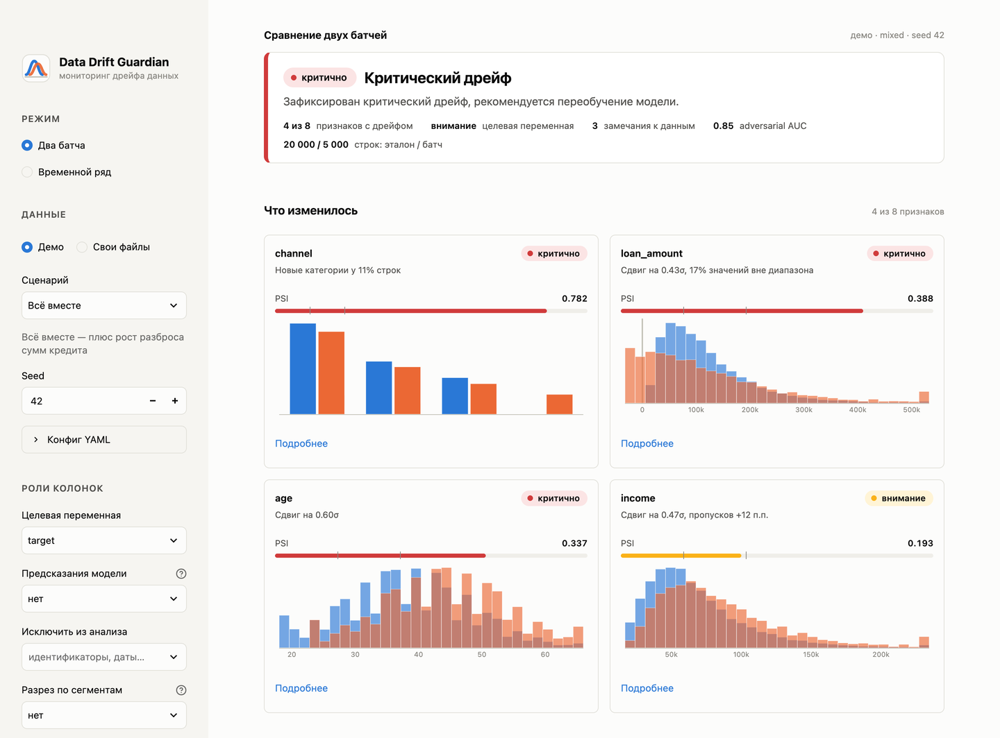
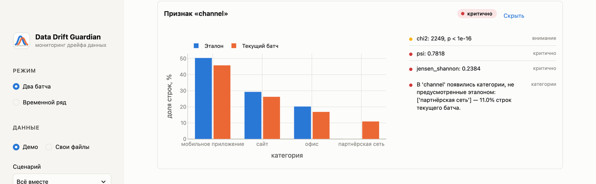
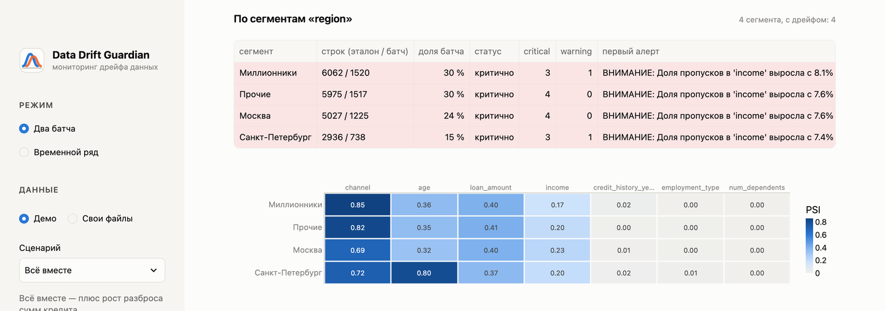
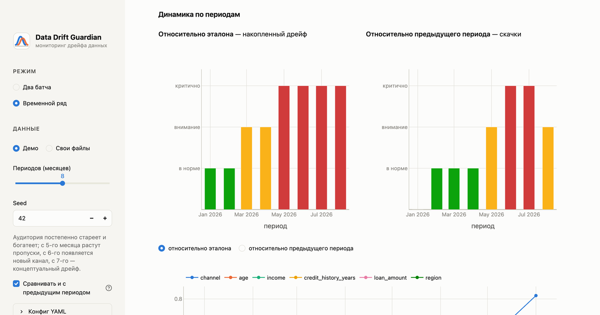
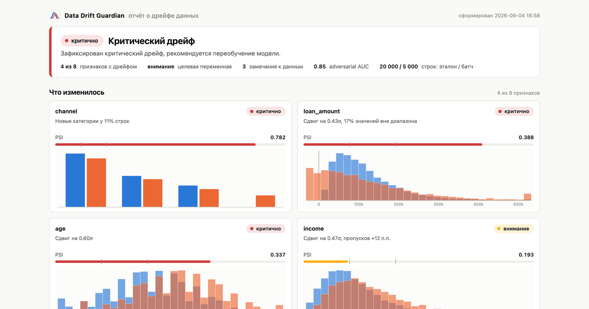

# Data Drift Guardian: система детекции дрейфа и контроля качества данных в продакшене

Итоговый проект «4.0 Школы аналитиков данных» МТС, задача № 4.

- **Заказчик:** Бояджи Владислав
- **Автор:** Георгий Мамарин (проект выполнен индивидуально)
- **Дата:** сентябрь 2026
- **Репозиторий:** <https://github.com/dmagog/mts-shad-drift-guardian>
- **Дашборд:** `streamlit run app/streamlit_app.py` или `docker run -p 8501:8501 drift-guardian`
- **Демонстрационный notebook:** `notebooks/demo.ipynb`
- **Скринкаст:** [docs/screencast.mp4](https://github.com/dmagog/mts-shad-drift-guardian/blob/main/docs/screencast.mp4) — 3 мин 16 с, с закадровым текстом и субтитрами

<!-- TOC -->

## 1. Постановка задачи

ML-модель в продакшене работает с непрерывным потоком данных, а мир вокруг неё меняется: сезонность,
инфляция, новые продуктовые каналы, изменения в процессах сбора данных. Код модели при этом не ломается —
предсказания генерируются, ошибок нет, — но их качество незаметно падает. Это дрейф данных
(Data Drift), а если меняется связь между признаками и целевой переменной — концептуальный дрейф
(Concept Drift). Для бизнеса это скрытые потери: кредитный скоринг начинает одобрять «не тех» клиентов,
антифрод пропускает новые схемы.

Задача кейса — разработать прототип аналитической системы, которая работает **без нейросетей** —
на математической статистике и классическом ML — и принимает на вход эталонную выборку (на которой
обучалась модель) и текущий продакшн-батч, проводит статистический анализ каждого признака,
вычисляет метрики расстояний между распределениями, проверяет качество данных и строит дашборд
с алертами. Ключевые требования ТЗ:

1. **Data Quality**: валидация типов, аномальное количество пропусков, дубликаты, соблюдение диапазонов Min/Max.
2. **Drift Engines**: тест Колмогорова–Смирнова и расстояние Вассерштейна для непрерывных признаков, хи-квадрат для категориальных.
3. **Индексы стабильности**: Population Stability Index и дивергенция Йенсена–Шеннона.
4. **Единый контракт**: два `pandas.DataFrame` на входе — структурированный словарь с метриками и флагами алертов на выходе.
5. **Adversarial Validation**: LightGBM-классификатор «прошлое против настоящего», ROC-AUC как интегральная мера дрейфа, feature importance как объяснение.
6. **Дашборд** на Streamlit (или HTML-отчёт через Plotly) с подсветкой «поплывших» признаков красным и системой алертов.
7. **Инженерия**: документация, unit-тесты, notebook на демонстрационном датасете с искусственно
   внесённым дрейфом, Dockerfile.

Сверх формальных требований я сформулировал критерий успеха. Система должна:

1. уверенно отличать батч без дрейфа от батчей с дрейфом разных типов;
2. не шуметь ни на больших, ни на малых выборках;
3. объяснять, что именно изменилось;
4. давать результаты, согласованные с Evidently;
5. быть воспроизводимой на чистой машине по инструкции из README.

## 2. Обзор подходов

**Виды дрейфа.** Различают covariate shift (изменилось распределение признаков $P(X)$),
prior shift (изменилась доля классов $P(Y)$) и concept drift (изменилась связь $P(Y\mid X)$).
Первый виден по самим данным, второй — по целевой переменной, третий без разметки заметить
невозможно, но его симптом — сдвиг $P(Y)$ при стабильном $P(X)$. Система покрывает все три случая:
признаки, целевую переменную и предсказания модели она анализирует раздельно.

**Статистические тесты** отвечают на вопрос «мог ли такой сдвиг возникнуть случайно». Двухвыборочный
тест Колмогорова–Смирнова сравнивает эмпирические функции распределения числовых признаков, хи-квадрат —
частоты категорий. Их слабость известна: при десятках тысяч наблюдений статистически значимым становится
любой микроскопический сдвиг, а на действительно одинаковых распределениях тесты ложно срабатывают
с частотой α.

**Метрики размера эффекта** отвечают на вопрос «насколько велик сдвиг». Population Stability Index — привычная в кредитном скоринге метрика со шкалой 0.1 / 0.2. Дистанция Йенсена–Шеннона —
симметричная, ограниченная $[0, 1]$ версия дивергенции Кульбака–Лейблера. Расстояние Вассерштейна —
«стоимость переноса» одного распределения в другое; нормированное на стандартное отклонение эталона,
для сдвига среднего оно равно величине сдвига в σ.

У этих метрик есть менее известная слабость: PSI и JS смещены вверх на малых выборках — при
отсутствии дрейфа их ожидание примерно $(k-1)(1/n_{ref}+1/n_{cur})$ для $k$ бинов, то есть на батче
в 200 строк с 10 бинами «шумовой» PSI около 0.05, а 95-й процентиль — около 0.09, вплотную к порогу
warning.

**Adversarial validation** — приём из соревновательного ML: если классификатор умеет отличать строки
эталона от строк батча, совместное распределение изменилось, а важности признаков показывают, где именно.
В отличие от поколоночных тестов, метод ловит многомерные сдвиги — например, изменение корреляции
дохода и суммы кредита при неизменных маргинальных распределениях.

Ориентирами по подаче служили open-source библиотеки Evidently и NannyML; система не копирует их,
а реализует те же идеи в объёме ТЗ, с собственной калибровкой порогов и защитой от малых выборок.
С Evidently метрики сверены численно (раздел 7).

## 3. Архитектура решения

```text
 reference.csv/parquet ─┐                                     ┌─ словарь-отчёт (контракт)
                        ├─ Data Ingestion Core ─ Schema ───┐   ├─ дашборд Streamlit (два батча / поток)
 current.csv/parquet ───┘   (io.py, schema.py, columns.py) │   ├─ HTML-отчёты (Plotly)
   или поток с датой                                       ▼   ├─ JSON, YAML-конфиг
 DriftConfig (YAML) ──► Оркестратор DriftGuardian ─────────────┤
   пороги, роли колонок,   ├─ Data Quality (data_quality.py)   └─ CLI, код возврата 0/1/2
   контракт данных         ├─ Drift Engines (drift_engines.py)
                           ├─ Adversarial Validation (adversarial.py)
                           └─ Блоки target / prediction (концептуальный дрейф)
 Поток батчей ──────────► timeline.py: период за периодом через DriftGuardian → статус и PSI по времени
```

| Модуль ТЗ | Реализация | Что делает |
|---|---|---|
| Data Ingestion Core | `io.py`, `schema.py`, `columns.py` | Читает CSV/Parquet, сверяет набор колонок и семейства типов, определяет роли: числовые, категориальные, идентификаторы и даты (последние пропускаются с пояснением) |
| Statistical Tool Library | `drift_engines.py` | KS, PSI, JS, Вассерштейн, хи-квадрат — изолированные функции на `scipy.stats` и `numpy`; бутстреп шумового уровня |
| Data Quality | `data_quality.py` | Пропуски, дубликаты, диапазоны, допустимые категории, константные колонки |
| Adversarial Validator Engine | `adversarial.py` | LightGBM + кросс-валидация, ROC-AUC, важности признаков |
| Оркестратор и контракт | `guardian.py`, `contracts.py`, `config.py` | Сбор отчёта, алерты, рекомендация; dataclass-контракт; конфигурация и YAML |
| Мониторинг во времени | `timeline.py` | Разбиение потока на периоды и сводка по ним |
| Визуализация и отчёты | `plots.py`, `html_report.py`, `app/streamlit_app.py`, `cli.py` | Графики, дашборд, HTML/JSON, командная строка |

**Контракт данных** (`DriftConfig`) описывает роли колонок и бизнес-правила: целевая переменная,
предсказания модели, исключаемые колонки, допустимые диапазоны значений и множества категорий. Если
правила не заданы, они выводятся из эталона. Конфиг хранится в YAML рядом с моделью
(`examples/config.yaml`) и скачивается из дашборда.

**Контракт результата** — словарь с полями `overall_severity`, `recommendation`, `alerts`, `schema`,
`data_quality`, `columns`, `target_drift`, `prediction_drift`, `adversarial`, `meta`. Каждый признак
описан списком тестов `{name, statistic, p_value, severity, threshold, details}`; в `details` — флаг
значимости, шумовой уровень и доверительный интервал. Пример — `examples/drift_report_mixed.json`.
Для потока `run_timeline` возвращает список периодов со статусом, рекомендацией, числом критичных
признаков, PSI по колонкам и алертами.

## 4. Методология

### 4.1 Типизация и роли колонок

Числовой dtype → числовая колонка, кроме целочисленных с не более чем 10 уникальными значениями
(коды, флаги) — они категориальные. Строки, `category` и `bool` — категориальные.

Колонки, у которых почти все значения уникальны (доля ≥ 0.98 при ≥ 100 строках), распознаются как
идентификаторы, а строки вида `2026-09-04` и dtype datetime — как даты; такие колонки пропускаются,
а причина попадает в отчёт. Без этого идентификатор тривиально «различал» бы эталон и батч в
adversarial validation. Эвристика переопределяется явными списками.

Схема батча сверяется с эталоном: пропавшая колонка или смена семейства типа — критический алерт,
новая колонка — предупреждение.

### 4.2 Качество данных

По каждой колонке сравнивается доля пропусков (алерт при приросте ≥ 5 п. п., критично ≥ 15 п. п.), по
таблице — доля полных дубликатов. Для числовых колонок считается доля значений вне допустимого
диапазона и доля бесконечностей, для категориальных — доля строк с недопустимыми категориями (1% /
5%); если новые категории отличаются от известных только пробелами или регистром, замечание
сопровождается подсказкой о сбое пайплайна. Отдельно отмечаются колонки, ставшие константными.

Все проверки долей работают по двухключевому правилу: доля должна превысить порог и статистически
отличаться от нуля (нижняя граница 95%-го интервала для разности долей больше нуля). Без этого одна
пустая ячейка в батче из 10 строк давала бы «+10 п. п. пропусков».

### 4.3 Тесты дрейфа

Для числового признака по эталону строятся 10 квантильных бинов (крайние открыты в бесконечность), и
по ним считаются PSI $= \sum_i (q_i - p_i)\ln(q_i/p_i)$ и дистанция Йенсена–Шеннона $\sqrt{\tfrac12
KL(p\|m) + \tfrac12 KL(q\|m)}$, $m = (p+q)/2$, по основанию 2. Это корень из дивергенции
Йенсена–Шеннона — симметризованной KL-дивергенции из постановки задачи; дистанция удобнее
дивергенции тем, что лежит в $[0, 1]$, удовлетворяет аксиомам метрики и совпадает с реализацией в
`scipy.spatial.distance.jensenshannon` и Evidently, поэтому пороги сопоставимы.

Расстояние Вассерштейна первого порядка нормируется на стандартное отклонение эталона (для
константного эталона — на разброс объединённой выборки). Двухвыборочный KS-тест даёт p-value.

Для категориального признака частоты считаются по объединённому множеству категорий (редкие сверх 20
группируются в «прочее»), а затем по ним вычисляются PSI, JS и хи-квадрат.

### 4.4 Калибровка порогов

Первая версия системы использовала «типовые» пороги из разных источников: PSI 0.1 / 0.2, Вассерштейн
0.1 / 0.3 (как в Evidently). Калибровочный эксперимент показал, что они несогласованы: сдвиг
среднего на 0.3σ давал PSI 0.086 (норма) и одновременно Вассерштейн 0.30 (критично) — одна метрика
перетягивала вердикт.

Пороги были пересчитаны так, чтобы все три метрики размера эффекта срабатывали примерно на одном и
том же сдвиге: warning около 0.3σ, critical около 0.5σ. Итоговые пороги: PSI 0.1 / 0.2, JS 0.1 /
0.2, Вассерштейн/σ 0.3 / 0.5.

Калибровка проверена не только на нормальном, но и на логнормальном, равномерном, бимодальном и
экспоненциальном распределениях (раздел 6). Для отдельных признаков пороги переопределяются в конфиге (`column_thresholds`) — например,
для шумных признаков, известной сезонности или колонок с допустимым большим сдвигом.

### 4.5 Двухключевое правило и поправка на множественные сравнения

p-value-тест (KS или хи-квадрат) считается сработавшим, только если он статистически значим
**и** хотя бы одна метрика размера эффекта превысила порог warning. Уровень critical определяют
только метрики размера эффекта. Так система не шумит на больших выборках и не даёт ложных
срабатываний на одинаковых распределениях, но p-value и флаг значимости всегда присутствуют
в отчёте. Уровень значимости делится на число проверяемых колонок (поправка Бонферрони);
для назначенных блоков — целевой переменной и предсказаний — поправка не применяется: это одна заранее заданная гипотеза.

### 4.6 Сглаживание долей

Доли в бинах и категориях ограничены снизу значением 10⁻⁴. Без этого PSI «взрывается» на любой
категории, которой не было в эталоне: 1% новой категории давал PSI 0.21 — критический алерт
из-за одной редкой строки. Со сглаживанием 1% → 0.05, 5% → 0.31, что согласуется
с порогами модуля качества данных для недопустимых категорий (1% / 5%).

### 4.7 Защита от малых выборок

Для каждой колонки параметрический бутстреп по биновым счётчикам (200 повторов, мультиномиальное
ресемплирование) оценивает две величины. Первая — шумовой уровень: 99-й процентиль PSI и JS,
если бы батч был выборкой из распределения эталона при тех же размерах (квантиль настраивается).
Вторая — доверительный интервал оценки при наблюдаемых распределениях. Если шумовой уровень выше порога warning, порог
поднимается до него, колонка помечается `underpowered`, а в отчёт добавляется информационное
замечание «батч мал». Так на батче в 150 строк система не поднимает тревогу из-за статистического
шума, а сильный сдвиг всё равно ловит (эксперимент в разделе 6).

Расстояние Вассерштейна в защите не нуждается: его шум порядка $1/\sqrt{n}$ и при n ≥ 50 далёк от
порога 0.3σ. Защита отключается параметром `sample_size_guard`.

### 4.8 Adversarial validation

Эталон и батч объединяются с меткой 0/1 (при необходимости — подвыборка до 50 000 строк),
категории кодируются, LightGBM (200 деревьев, `learning_rate` 0.05) оценивается трёхкратной
стратифицированной кросс-валидацией. ROC-AUC симметризуется как $\max(\text{AUC}, 1-\text{AUC})$;
пороги 0.55 / 0.65. Важности признаков (gain) нормируются и попадают в отчёт.

Два практических уточнения, найденных при проверке граничных сценариев. Во-первых, строки-двойники:
если батч содержит строки, точно совпадающие со строками эталона (перекрывающиеся окна, общие
клиенты), кросс-валидация «узнаёт» двойника из обучающей части и завышает ROC-AUC — на полностью
идентичных выборках метод давал 0.77. Совпадающие строки исключаются из обучения, их доля
фиксируется в отчёте, а полностью идентичные выборки получают AUC 0.5.

Во-вторых, потоки: на небольших выборках многопоточность LightGBM замедляла обучение в 13 раз, а на
матрицах от миллиона ячеек четыре потока ускоряли его вдвое, поэтому число потоков выбирается
автоматически.

### 4.9 Концептуальный дрейф

Если в конфиге указана целевая переменная, она исключается из анализа признаков и из adversarial validation,
а разбирается отдельным блоком тем же набором тестов. Если блок цели критичен,
а среди признаков критичных нет, рекомендация меняется: «признаки стабильны, но распределение
целевой переменной изменилось — вероятен концептуальный дрейф, нужно переобучение на свежих
размеченных данных». Аналогичный блок предусмотрен для предсказаний модели.

### 4.10 Мониторинг во времени

Поток батчей разбивается по колонке даты на календарные периоды (день, неделя, месяц, квартал), каждый
период сравнивается с эталоном полным набором проверок, а сводка по периодам показывает статус,
число критичных признаков, PSI по колонкам, ROC-AUC adversarial validation и алерты. Так виден
момент начала дрейфа и его динамика, а не только «есть / нет» на одном снимке.

Второй взгляд — сравнение каждого периода с предыдущим (`compare_previous`): относительно эталона
статусы накапливаются, относительно предыдущего периода подсвечены только скачки. На демо-потоке с
постепенным старением аудитории первый взгляд даёт «критично» с мая и далее, второй отмечает май,
июнь и июль, когда добавлялись пропуски, новый канал и концептуальный дрейф, а в промежуточных
периодах статус остаётся «в норме».

### 4.11 Разрез по сегментам

Дрейф часто локален: плывёт один регион, канал или тариф, а в объединённых данных сдвиг размывается.
При заданной `segment_column` анализ повторяется внутри каждого из самых частых значений колонки
(до `max_segments`); результат — таблица сегментов и тепловая карта PSI «сегмент × признак».
Критический дрейф внутри сегмента поднимает общий статус хотя бы до «внимание» и попадает
в рекомендацию. Проверка: сдвиг возраста на 10 лет только для Москвы даёт в объединённых данных
JS 0.10 на границе «внимания», а внутри сегмента — PSI 1.39 и «критично». Сегмент, исчезнувший
из батча, отмечается отдельно.

### 4.12 Агрегация и недостаточные данные

Три уровня серьёзности (`ok`, `warning`, `critical`) на экранах и в отчётах подписаны словами
«в норме», «внимание», «критично». Итоговая серьёзность — наихудшая среди схемы, качества данных,
признаков, adversarial validation и назначенных блоков. Информационные замечания (пропущенные колонки, малые батчи) имеют уровень `ok` и
не поднимают тревогу. Каждому алерту соответствует человекочитаемая строка на русском языке с
метриками и p-value.

Батч или эталон меньше `min_samples` строк (по умолчанию 20) не получает вердикт «ok» по пропущенным
тестам: система выставляет «внимание», пропускает и статистические тесты, и проверки качества
(против крошечного эталона они давали бы мусорные алерты) и прямо рекомендует накопить данные; на
батчах от 20 до нескольких сотен строк рекомендация упоминает сниженную чувствительность. Дубликаты
имён колонок останавливают анализ с критическим замечанием.

## 5. Реализация

**Стек.**

- Вычисления: Python 3.12, pandas, numpy, scipy, scikit-learn, LightGBM.
- Интерфейс и отчёты: Streamlit, Plotly, Jinja2, PyYAML.
- Качество кода: pytest и `streamlit.testing`, ruff, CI на GitHub Actions.

**Пакет `drift_guardian`.** 15 модулей и три точки входа:

- `analyze(reference, current, config)` — сравнение двух батчей;
- `run_timeline_from_frame(reference, stream, date_column, freq, config)` — поток батчей во времени;
- `DriftGuardian.run` — объектный вариант для встраивания в пайплайны.

**Дашборд** (`app/streamlit_app.py`) отвечает на вопросы в порядке важности. Наверху вердикт со
статусом, рекомендацией и ключевыми фактами. Ниже карточки «что изменилось»: поплывшие признаки,
ранжированные по серьёзности, с объяснением в одну строку, полосой PSI относительно порогов и
мини-графиком «эталон против батча».

Клик «Подробнее» раскрывает панель признака с полным графиком, тестами и замечаниями к качеству.
Дальше блоки целевой переменной и предсказаний, разрез по сегментам (таблица и тепловая карта PSI
«сегмент × признак»), замечания к данным и подробности во вкладках «Все признаки», «Распределения»,
«Схема и качество», «Adversarial validation», «Экспорт» (HTML, JSON, YAML-конфиг).

Второй режим, «Временной ряд», показывает статусы и PSI по периодам — относительно эталона
и относительно предыдущего периода — а также разбор любого периода. В боковой панели — источник данных (демо или свои CSV/Parquet), роли колонок, загрузка YAML-конфига,
пороги в раскрывающемся блоке; deep-links `?mode=stream`, `?scenario=…`, `?segment=…`. Статусы
передаются цветом и словом («в норме», «внимание», «критично»); палитра графиков (синий эталон,
оранжевый батч) различима при дальтонизме.



<p class="muted">Вердикт и карточки признаков с дрейфом, сценарий «всё вместе».</p>



<p class="muted">Панель признака после клика «Подробнее»: полный график, тесты, замечания к качеству.</p>



<p class="muted">Разрез по сегментам: таблица статусов и тепловая карта PSI «сегмент × признак».</p>



<p class="muted">Режим «Временной ряд»: статусы по периодам относительно эталона и относительно предыдущего периода.</p>

**HTML-отчёты** самодостаточны (Plotly.js встраивается или подгружается из CDN) и собраны из тех же
компонентов, что и дашборд; **JSON** повторяет контракт. **CLI** `drift-guardian` работает в обоих
режимах и возвращает код 0/1/2 по серьёзности — удобно для cron и CI. **Docker-образ** запускает
дашборд одной командой.



<p class="muted">Самодостаточный HTML-отчёт: тот же вердикт, карточки и графики, что в дашборде.</p>

**Качество и воспроизводимость.**

- 101 тест: движки, качество данных, схема и роли колонок, adversarial validation, оркестратор,
  конфиг, CLI, временной ряд, HTML/JSON, смоук-тесты дашборда в обоих режимах.
- CI на каждый push, зафиксированные версии зависимостей в `requirements-lock.txt`.
- Детерминированный генератор демо-данных с seed, выполненный notebook с выводами.
- Скрипты пересобирают таблицы экспериментов, галерею реальных данных и этот отчёт.

**Производительность.** Замеры на MacBook Pro (Apple M1, 8 ядер, 8 ГБ):

- эталон 20 000 строк против батча 5 000 строк, 9 колонок — 4–8 с, основное время занимает
  adversarial validation;
- эталон 32 000 строк против батча 5 500 строк, 15 колонок — 17 с;
- бутстреп шумового уровня добавляет миллисекунды на колонку.

## 6. Эксперименты

Все числа ниже сгенерированы скриптом `scripts/experiments.py` и воспроизводимы.

<!-- EXPERIMENTS -->

### Что показали эксперименты

**Демо-сценарии.** Каждый сценарий распознан правильно: контрольный батч без дрейфа чист (0 алертов,
ROC-AUC 0.50); сдвиг среднего пойман по `age` и `income` с подтверждением adversarial validation
(0.76); рост пропусков дал ровно один алерт качества данных и уровень warning; новая категория
канала — критический алерт качества и дрейф по `channel`. Сценарий концептуального дрейфа —
ключевой: признаки стабильны, adversarial validation молчит (0.52), но блок целевой переменной
критичен, и система выдаёт отдельную рекомендацию. Без выделенного блока цели этот случай остался
бы невидимым.

**Калибровка.** После пересчёта порогов PSI, JS и Вассерштейн срабатывают на одном и том же сдвиге
(0.3σ — warning по JS, 0.4σ — warning всеми, 0.5σ — critical), а на изменение разброса и перенос
массы между категориями реагируют согласованно. Сглаживание убрало «взрыв» PSI на редких новых
категориях.

На негауссовых распределениях картина не сохраняется, и это важный результат: при том же сдвиге на
0.3σ PSI даёт 0.086 для нормального признака, 0.23 для логнормального и равномерного, 0.33 для
бимодального и 1.48 для экспоненциального. Причина не в ошибке метрики: у распределений с плотной
границей (экспоненциальное у нуля, равномерное у краёв) сдвиг на 0.3σ выносит массу из первых
квантильных бинов — форма распределения меняется сильно, и PSI с JS это честно фиксируют. Расстояние
Вассерштейна, напротив, по построению равно сдвигу в σ независимо от формы.

Практический вывод: понятие «сдвиг на 0.3σ» не универсально, PSI и JS чувствительны к форме,
Вассерштейн — к положению и масштабу, и именно их совместное использование даёт полную картину.
Пороги по умолчанию откалиброваны на нормальном признаке, поэтому для скошенных и ограниченных
распределений срабатывают раньше — система в таких случаях осторожнее, а не слабее; при
необходимости пороги для конкретного признака поднимаются в конфиге.

**Ложные срабатывания.** На 30 батчах без дрейфа наивное правило «p-value < α», даже с поправкой
Бонферрони, дало ложные алерты в 2 батчах; двухключевое правило — ни одного.

**Размер батча.** Без защиты PSI и JS на батчах в 100 строк без дрейфа ложно срабатывают почти в
половине колонок (117 из 270) и во всех 30 батчах; шумовой уровень PSI (99-й процентиль) при n =
100 равен 0.125, при n = 200 — 0.063, а от 500 строк опускается ниже 0.03, и порог 0.1 работает без
поправок. С защитой ложных колонок остаётся 7 из 270 при n = 100 и 4 из 270 при n = 200 — ожидаемый
уровень около 1% на колонку при квантиле 0.99 плюс редкие срабатывания проверок качества (доля
значений вне диапазона на сотне строк).

Сильный сдвиг защита не маскирует: сдвиг на 1.5σ на 150 строках по-прежнему даёт critical (тест
`test_small_batch_with_strong_shift_still_critical`). Практический вывод: батчи меньше 500 строк для
PSI и JS малоинформативны, и система прямо говорит об этом пометкой `underpowered` вместо ложной
тревоги.

**Реальные данные.** На датасете bank-marketing (UCI, через OpenML) эталоном служат контакты
мая–августа, батчем — сентября–декабря. Признаки анонимизированы (`V1`–`V16`); по описанию исходного
датасета они означают:

| Признак | Смысл |
|---|---|
| `V6` | баланс счёта |
| `V9` | тип контакта |
| `V10` | день месяца |
| `V13` | число контактов в кампании |
| `V14`, `V15`, `V16` | история предыдущих кампаний |
| `Class` | согласие на депозит |

Система за 17 с нашла критический дрейф по семи признакам с внятной картиной: осенью кампания
работала с другими клиентами (тип контакта, история предыдущих кампаний), сместился баланс, а доля
согласий выросла — блок целевой переменной дал warning (prior shift). Adversarial validation
различает батчи почти идеально (0.957) — реальный сезонный дрейф многомерен и велик.

## 7. Сверка с Evidently

Метрики системы сверены с библиотекой Evidently — функциями статтестов самой Evidently: на четырёх
демо-сценариях и на реальном датасете. Сверка запускается в отдельном окружении, потому что
у Evidently свои требования к зависимостям.

<!-- BENCHMARK -->

Поколоночные значения обеих реализаций — в приложении В.

### Что показала сверка

Расстояние Вассерштейна и p-value KS-теста совпадают с Evidently точно (ρ = 1.0, разница 0): обе
реализации опираются на одни и те же функции `scipy`. Дистанция Йенсена–Шеннона совпадает с
точностью до основания логарифма: Evidently считает JS в натуральном логарифме, Data Drift Guardian
— по основанию 2, чтобы метрика лежала в $[0, 1]$; отношение значений равно $\sqrt{\ln 2} \approx
0.83$ (например, 0.100 здесь против 0.083 у Evidently).

PSI согласован по ранжированию (ρ = 0.97), но абсолютные значения зависят от разбиения: Evidently
использует 30 квантильных бинов, Data Drift Guardian — 10, поэтому на числовых признаках PSI у Evidently
обычно выше (`age`: 0.62 против 0.37), а на дискретных признаках с массой одинаковых значений
(баланс счёта, число предыдущих контактов) — ниже. Это важный практический вывод: **порог PSI имеет
смысл только вместе с конвенцией о бинах**, поэтому в системе конвенция зафиксирована и
откалибрована.

Решения «дрейф / нет» совпали с методом Evidently по умолчанию в 45 из 47 колонок. Два расхождения
объяснимы: `V1` (возраст) сдвинулся на 0.22σ — по откалиброванному порогу 0.3σ это норма, а порог
Evidently по умолчанию для Вассерштейна равен 0.1σ и заметно чувствительнее; `V7` (ипотека) имеет
JS ровно 0.100 здесь и 0.083 у Evidently — та же граница 0.1 при разном основании логарифма.

## 8. Граничные сценарии

Отдельный прогон проверяет поведение системы на «неудобных» данных: крошечные батчи,
идентичные или перекрывающиеся выборки, дубликаты имён колонок, бесконечности, свободный текст,
широкие и большие таблицы, кодировка cp1251, мусор в датах потока. Первая версия системы
на идентичных выборках выдавала «критично» с ROC-AUC 0.77 (строки-двойники «подсказывали»
adversarial-модели метку через кросс-валидацию), падала на дубликатах имён колонок и ставила батчу из 10 строк вердикт «умеренные сдвиги» из-за шума в доле пропусков. Все эти случаи
исправлены и закреплены тестами; таблица ниже — актуальное поведение.

<!-- EDGE_CASES -->

### Реальные данные

Синтетика не заменяет живых данных, поэтому система дополнительно прогнана на трёх открытых датасетах OpenML разной формы, в четырёх сценариях
(`scripts/real_data_gallery.py`, отчёты в `examples/real/`):

- **adult, случайный сплит** — контроль на ложные тревоги: 14 признаков, 49 тысяч строк,
  вердикт «в норме», adversarial AUC 0.50.
- **adult, батч «люди старше 50»** — контролируемый ковариатный сдвиг: критично по возрасту,
  семейному положению и образованию при стабильной доле таргета.
- **credit-g** (20 признаков, 700 против 300 строк) — «в норме» без шумных алертов.
- **electricity, начало ряда против конца** — настоящий дрейф: критично по ценам и спросу
  с разрезом по дням недели.

Именно этот прогон нашёл два дефекта, невидимых на синтетике. В electricity несколько признаков в
эталоне почти константны: PSI и JS вырождались в ноль, а расстояние Вассерштейна, нормированное на σ
эталона, превращалось в число вида 4·10¹⁶, которое попадало в карточку. Теперь при константном
эталоне сдвиг нормируется на разброс объединённой выборки («константа изменилась» даёт сдвиг около
2σ), карточка показывает долю значений вне диапазона и пишет «эталон почти константен».

Второй дефект — колонка `date` (нормированное время) тривиально «дрейфует» и заслоняет остальные
признаки; система теперь замечает непересекающиеся диапазоны и подсказывает исключить такую колонку,
не отключая при этом обнаружение дрейфа.

<!-- REAL_DATA -->

## 9. Ограничения и развитие

- Колонки типов datetime и строки с датами пропускаются; временные признаки преобразуйте заранее в числа (например, «дней с события»).
- Пороги по умолчанию — откалиброванные отраслевые ориентиры; для конкретной модели подберите их по историческим батчам (в дашборде это делается ползунками, в конфиге — YAML).
- Adversarial validation работает на подвыборке до 50 000 строк; для миллионов строк это осознанный
  компромисс между точностью и временем.
- В режиме потока эталон фиксирован, дополнительно доступно сравнение с предыдущим периодом;
  произвольное скользящее окно эталона и тренды «скорости» дрейфа — следующий шаг.
- Развитие: интеграция с оркестраторами (Airflow) через CLI, алерты в мессенджеры, автоматический подбор
  порогов по истории.

## 10. Выводы

Построен прототип системы мониторинга дрейфа и качества данных, полностью закрывающий требования ТЗ:
четыре аналитических модуля, строгий контракт «два DataFrame → словарь с метриками и флагами»,
дашборд с подсветкой поплывших признаков, HTML/JSON-экспорт, CLI, Docker, тесты, CI и notebook.

Сверх ТЗ реализованы контракт данных с бизнес-правилами и автодетекцией ролей колонок, отдельный
блок концептуального дрейфа по целевой переменной, мониторинг во времени и калибровка порогов,
в том числе на негауссовых распределениях. Отдельно стоят двухключевое правило и бутстреп-защита
от малых выборок: эти две меры снимают главные практические проблемы статистического мониторинга —
шум на больших выборках и смещение метрик на малых.

Метрики численно сверены с Evidently. Эксперименты на синтетических сценариях и реальном датасете
подтверждают, что система различает типы дрейфа, объясняет их и не даёт ложных тревог на стабильных
данных.

## Приложение А. Как воспроизвести

```bash
git clone https://github.com/dmagog/mts-shad-drift-guardian && cd mts-shad-drift-guardian
python -m venv .venv && source .venv/bin/activate && pip install -e ".[dev]"
pytest -q                                          # тесты
python scripts/experiments.py --out report         # эксперименты (раздел 6)
uv venv .venv-bench && uv pip install --python .venv-bench/bin/python evidently scikit-learn pyyaml scipy
.venv-bench/bin/python scripts/benchmark_evidently.py --out report   # сверка (раздел 7)
SSL_CERT_FILE=$(python -c "import certifi; print(certifi.where())") \
  python scripts/real_data_gallery.py              # реальные данные OpenML (раздел 8)
python scripts/build_report.py                     # этот отчёт в HTML
streamlit run app/streamlit_app.py                 # дашборд
```

## Приложение Б. Соответствие требованиям ТЗ

| Требование ТЗ | Где реализовано | Проверка |
|---|---|---|
| Data Quality: типы, NaN, дубликаты, Min/Max | `schema.py`, `data_quality.py`, `columns.py` | `tests/test_schema.py`, `tests/test_data_quality.py`, `tests/test_columns.py` |
| KS-тест, Вассерштейн, хи-квадрат | `drift_engines.py` | `tests/test_drift_engines.py` |
| PSI и Jensen–Shannon | `drift_engines.py` | `tests/test_drift_engines.py`, сверка с Evidently |
| Контракт: два DataFrame → словарь с метриками и флагами | `guardian.py`, `contracts.py` | `tests/test_guardian.py` |
| Adversarial Validation, ROC-AUC, Feature Importance | `adversarial.py` | `tests/test_adversarial.py` |
| Schema Validation | `schema.py` | `tests/test_schema.py` |
| Дашборд Streamlit с подсветкой и алертами / HTML через Plotly | `app/streamlit_app.py`, `html_report.py` | `tests/test_app.py`, `tests/test_report.py` |
| Документация, unit-тесты, notebook с искусственным дрейфом | `README.md`, `tests/` (101 тест), `notebooks/demo.ipynb` | CI на каждый push |
| Репозиторий: README (описание, установка, запуск, пример), файл зависимостей, конфиги YAML | `README.md`, `pyproject.toml`, `requirements.txt`, `requirements-lock.txt`, `examples/config.yaml` | проверка с чистого checkout |
| Итоговый отчёт (HTML) в `/report` | `report/report.md` → `report/report.html` (самодостаточный файл) | `scripts/build_report.py` |
| Dockerfile и инструкция запуска, скринкаст 2–5 минут | `Dockerfile`, README; скринкаст по `docs/screencast.md` | сборка образа; скринкаст прикладывается при сдаче |
| Данные ссылками, генератор с фиксированным seed | OpenML: adult, credit-g, electricity, bank-marketing (ссылки в README и отчёте); `scripts/generate_demo.py --seed 42` | `examples/real/gallery.md` |
| Воспроизводимость по README | `pip install -e ".[dev]"` → `pytest` → CLI → `streamlit run` | прогон с чистого клона репозитория |
| Сверх ТЗ: контракт данных, концептуальный дрейф, поток во времени (в т. ч. к предыдущему периоду), разрез по сегментам, поколоночные пороги, защита от малых выборок, сверка с Evidently, прогон на реальных данных | `config.py`, `guardian.py`, `timeline.py`, `drift_engines.py`, `scripts/benchmark_evidently.py`, `scripts/real_data_gallery.py` | `tests/test_config.py`, `tests/test_timeline.py`, `tests/test_guardian.py`, `report/benchmark_evidently.md`, `report/real_data.md` |

## Приложение В. Поколоночная сверка с Evidently

Значения обеих реализаций по всем колонкам каждого сценария; сводка и интерпретация — в разделе 7.

<!-- BENCHMARK_TABLES -->
